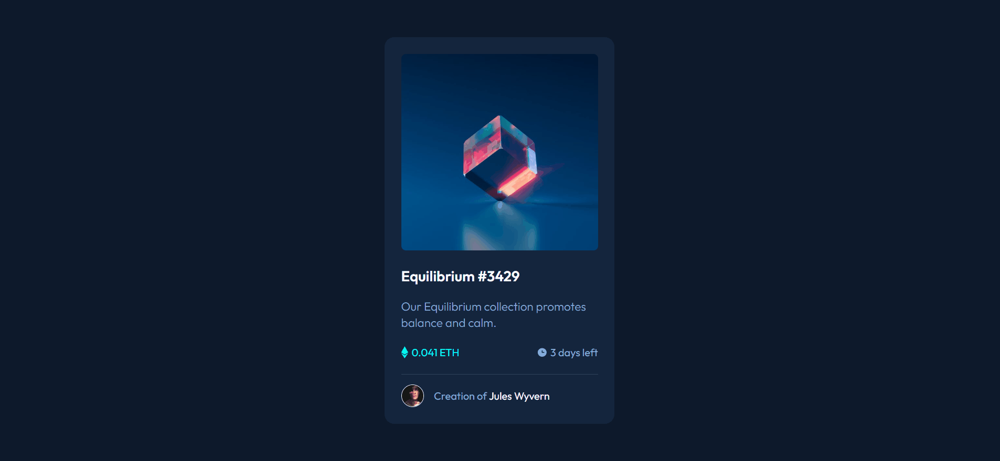
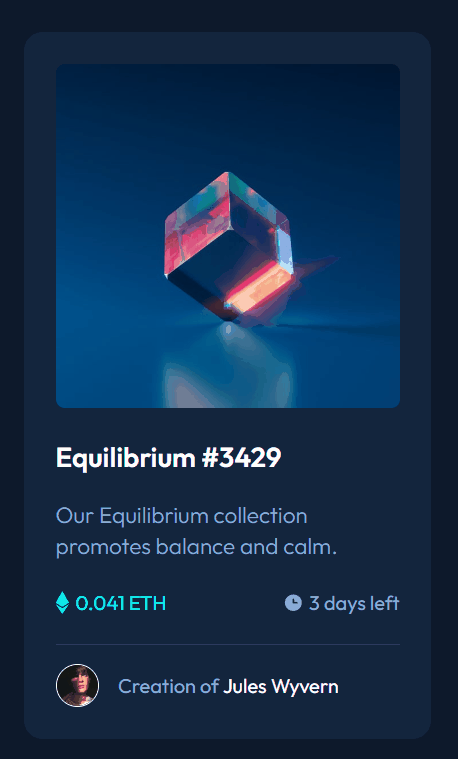

# Frontend Mentor | NFT preview card component
Esta é uma solução para o desafio NFT preview card component do Frontend Mentor.

## Índice

- Design
- Links
- Tecnologias utilizadas

## Visão geral

### Design desktop 🖥️

### Design mobile 📱

## Links

- Desafio do Frontend Mentor: [NFT preview card component](https://www.frontendmentor.io/challenges/nft-preview-card-component-SbdUL_w0U)

## Tecnologias utilizadas

- HTML
- CSS
